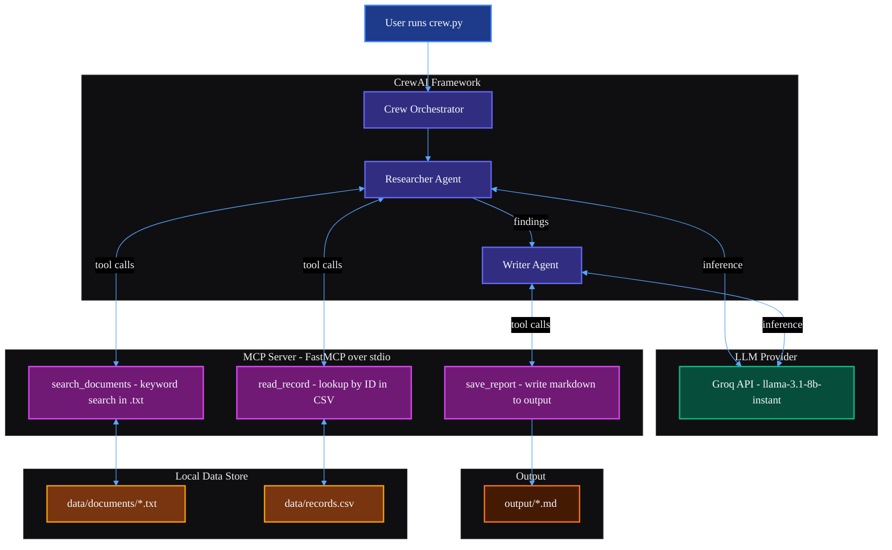
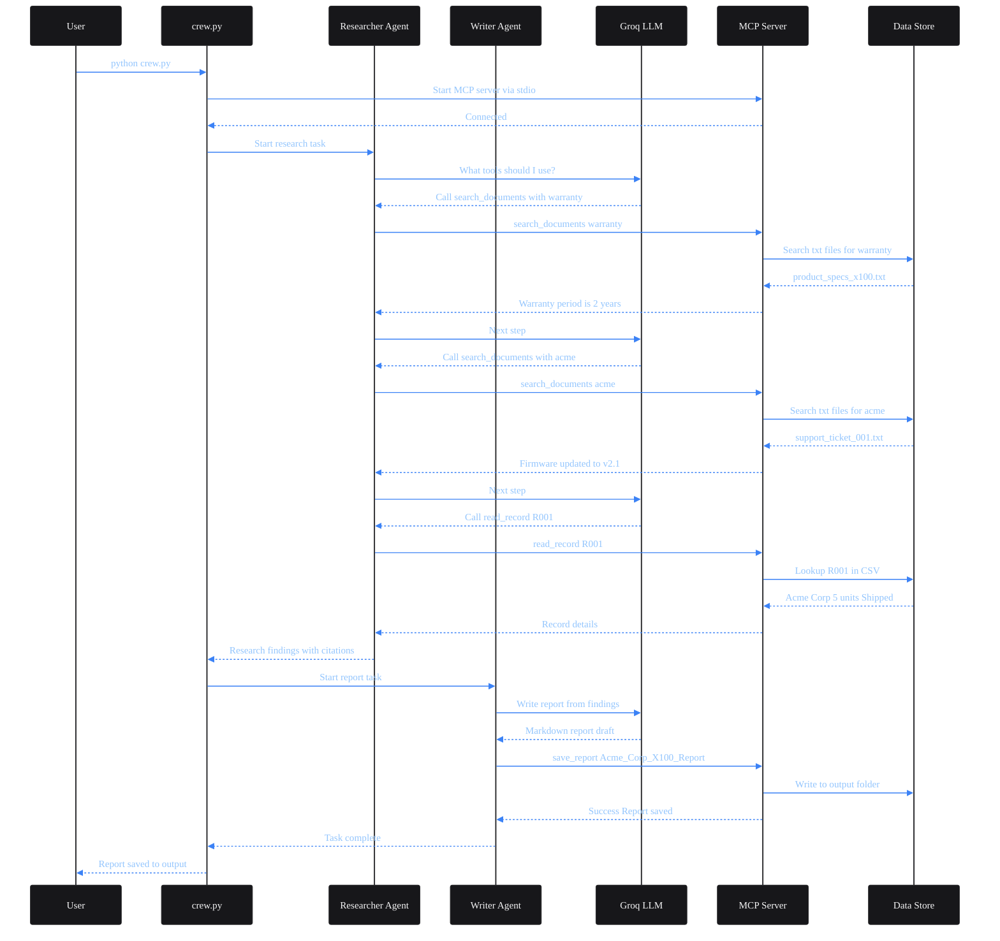
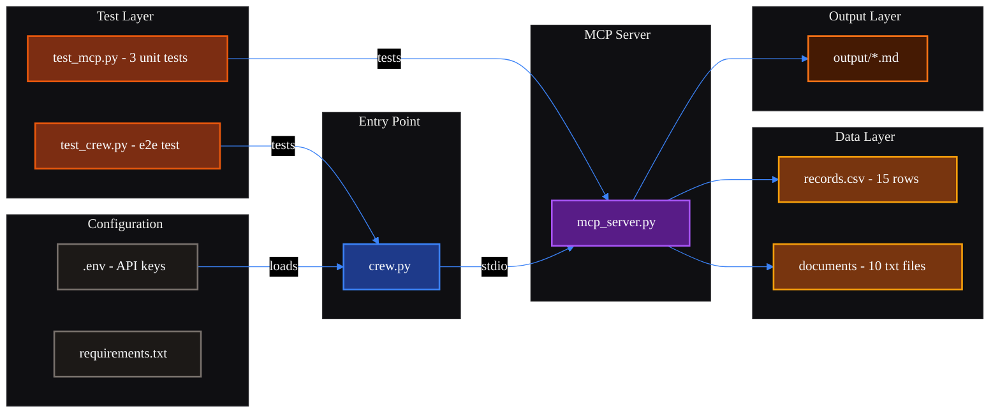
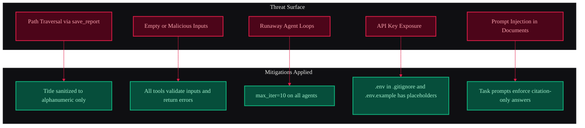
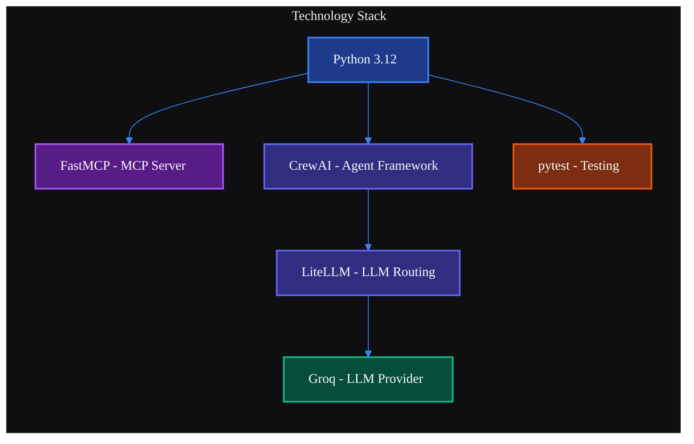

# High-Level Design — Operations Assistant

## Architecture Diagram

```mermaid
---
config:
  theme: base
  themeVariables:
    darkMode: true
    background: "#0a0a0c"
    primaryColor: "#17171a"
    primaryTextColor: "#f4f4f5"
    primaryBorderColor: "#27272a"
    lineColor: "#58a6ff"
    textColor: "#f4f4f5"
    mainBkg: "#17171a"
    nodeBorder: "#27272a"
    clusterBkg: "#0f0f12"
    clusterBorder: "#27272a"
    tertiaryColor: "#0f0f12"
    tertiaryBorderColor: "#27272a"
    fontFamily: "system-ui, -apple-system, BlinkMacSystemFont, 'Segoe UI', Roboto, 'Helvetica Neue', Arial, sans-serif"
---
graph TB
    User["User runs crew.py"]

    subgraph CrewAI_Framework["CrewAI Framework"]
        Crew["Crew Orchestrator"]
        Researcher["Researcher Agent"]
        Writer["Writer Agent"]
    end

    subgraph LLM_Provider["LLM Provider"]
        Groq["Groq API - llama-3.1-8b-instant"]
    end

    subgraph MCP_Server["MCP Server - FastMCP over stdio"]
        Tool1["search_documents - keyword search in .txt"]
        Tool2["read_record - lookup by ID in CSV"]
        Tool3["save_report - write markdown to output"]
    end

    subgraph Data_Store["Local Data Store"]
        Docs["data/documents/*.txt"]
        CSV["data/records.csv"]
    end

    subgraph Output_Store["Output"]
        Report["output/*.md"]
    end

    User --> Crew
    Crew --> Researcher
    Researcher -->|findings| Writer

    Researcher <-->|tool calls| Tool1
    Researcher <-->|tool calls| Tool2
    Writer <-->|tool calls| Tool3

    Researcher <-->|inference| Groq
    Writer <-->|inference| Groq

    Tool1 <--> Docs
    Tool2 <--> CSV
    Tool3 --> Report

    classDef default fill:#17171a,stroke:#27272a,stroke-width:1px,color:#f4f4f5;
    classDef user fill:#1e3a8a,stroke:#3b82f6,stroke-width:2px,color:#f8fafc;
    classDef agent fill:#312e81,stroke:#6366f1,stroke-width:2px,color:#f8fafc;
    classDef llm fill:#064e3b,stroke:#10b981,stroke-width:2px,color:#f8fafc;
    classDef tool fill:#701a75,stroke:#d946ef,stroke-width:2px,color:#f8fafc;
    classDef store fill:#78350f,stroke:#f59e0b,stroke-width:2px,color:#f8fafc;
    classDef output fill:#451a03,stroke:#f97316,stroke-width:2px,color:#f8fafc;
    
    class User user;
    class Crew,Researcher,Writer agent;
    class Groq llm;
    class Tool1,Tool2,Tool3 tool;
    class Docs,CSV store;
    class Report output;
```

## Sequence Diagram

```mermaid
---
config:
  theme: base
  themeVariables:
    darkMode: true
    background: "#0a0a0c"
    actorBkg: "#17171a"
    actorBorder: "#27272a"
    actorTextColor: "#f4f4f5"
    signalColor: "#3b82f6"
    signalTextColor: "#93c5fd"
    lineColor: "#3b82f6"
    textColor: "#f4f4f5"
    labelBoxBkgColor: "#17171a"
    labelBoxBorderColor: "#27272a"
    labelTextColor: "#f4f4f5"
    loopLimitBkgColor: "#17171a"
    loopLimitBorderColor: "#27272a"
    fontFamily: "system-ui, -apple-system, BlinkMacSystemFont, 'Segoe UI', Roboto, 'Helvetica Neue', Arial, sans-serif"
---
sequenceDiagram
    participant U as User
    participant C as crew.py
    participant R as Researcher Agent
    participant W as Writer Agent
    participant LLM as Groq LLM
    participant MCP as MCP Server
    participant D as Data Store

    U->>C: python crew.py
    C->>MCP: Start MCP server via stdio
    MCP-->>C: Connected

    C->>R: Start research task
    R->>LLM: What tools should I use?
    LLM-->>R: Call search_documents with warranty
    R->>MCP: search_documents warranty
    MCP->>D: Search txt files for warranty
    D-->>MCP: product_specs_x100.txt
    MCP-->>R: Warranty period is 2 years

    R->>LLM: Next step
    LLM-->>R: Call search_documents with acme
    R->>MCP: search_documents acme
    MCP->>D: Search txt files for acme
    D-->>MCP: support_ticket_001.txt
    MCP-->>R: Firmware updated to v2.1

    R->>LLM: Next step
    LLM-->>R: Call read_record R001
    R->>MCP: read_record R001
    MCP->>D: Lookup R001 in CSV
    D-->>MCP: Acme Corp 5 units Shipped
    MCP-->>R: Record details

    R-->>C: Research findings with citations

    C->>W: Start report task
    W->>LLM: Write report from findings
    LLM-->>W: Markdown report draft
    W->>MCP: save_report Acme_Corp_X100_Report
    MCP->>D: Write to output folder
    MCP-->>W: Success Report saved

    W-->>C: Task complete
    C-->>U: Report saved to output
```

## Component Diagram

```mermaid
---
config:
  theme: base
  themeVariables:
    darkMode: true
    background: "#0a0a0c"
    primaryColor: "#17171a"
    primaryTextColor: "#f4f4f5"
    primaryBorderColor: "#27272a"
    lineColor: "#3b82f6"
    textColor: "#f4f4f5"
    mainBkg: "#17171a"
    nodeBorder: "#27272a"
    clusterBkg: "#0f0f12"
    clusterBorder: "#27272a"
    tertiaryColor: "#0f0f12"
    tertiaryBorderColor: "#27272a"
    fontFamily: "system-ui, -apple-system, BlinkMacSystemFont, 'Segoe UI', Roboto, 'Helvetica Neue', Arial, sans-serif"
---
graph LR
    subgraph Entry["Entry Point"]
        A["crew.py"]
    end

    subgraph Server["MCP Server"]
        B["mcp_server.py"]
    end

    subgraph DataLayer["Data Layer"]
        C["documents - 10 txt files"]
        D["records.csv - 15 rows"]
    end

    subgraph OutputLayer["Output Layer"]
        E["output/*.md"]
    end

    subgraph TestLayer["Test Layer"]
        F["test_mcp.py - 3 unit tests"]
        G["test_crew.py - e2e test"]
    end

    subgraph Config["Configuration"]
        H[".env - API keys"]
        I["requirements.txt"]
    end

    A -->|stdio| B
    B --> C
    B --> D
    B --> E
    F -->|tests| B
    G -->|tests| A
    H -->|loads| A

    classDef entry fill:#1e3a8a,stroke:#3b82f6,stroke-width:2px,color:#f8fafc;
    classDef server fill:#581c87,stroke:#a855f7,stroke-width:2px,color:#f8fafc;
    classDef data fill:#78350f,stroke:#f59e0b,stroke-width:2px,color:#f8fafc;
    classDef output fill:#451a03,stroke:#f97316,stroke-width:2px,color:#f8fafc;
    classDef test fill:#7c2d12,stroke:#ea580c,stroke-width:2px,color:#f8fafc;
    classDef config fill:#1c1917,stroke:#78716c,stroke-width:2px,color:#f8fafc;

    class A entry;
    class B server;
    class C,D data;
    class E output;
    class F,G test;
    class H,I config;
```

## Security Model

```mermaid
---
config:
  theme: base
  themeVariables:
    darkMode: true
    background: "#0a0a0c"
    primaryColor: "#17171a"
    primaryTextColor: "#f4f4f5"
    primaryBorderColor: "#27272a"
    lineColor: "#e11d48"
    textColor: "#f4f4f5"
    mainBkg: "#17171a"
    nodeBorder: "#27272a"
    clusterBkg: "#0f0f12"
    clusterBorder: "#27272a"
    tertiaryColor: "#0f0f12"
    tertiaryBorderColor: "#27272a"
    fontFamily: "system-ui, -apple-system, BlinkMacSystemFont, 'Segoe UI', Roboto, 'Helvetica Neue', Arial, sans-serif"
---
graph TD
    subgraph Threats["Threat Surface"]
        T1["Path Traversal via save_report"]
        T2["Empty or Malicious Inputs"]
        T3["Runaway Agent Loops"]
        T4["API Key Exposure"]
        T5["Prompt Injection in Documents"]
    end

    subgraph Mitigations["Mitigations Applied"]
        M1["Title sanitized to alphanumeric only"]
        M2["All tools validate inputs and return errors"]
        M3["max_iter=10 on all agents"]
        M4[".env in .gitignore and .env.example has placeholders"]
        M5["Task prompts enforce citation-only answers"]
    end

    T1 --> M1
    T2 --> M2
    T3 --> M3
    T4 --> M4
    T5 --> M5

    classDef threat fill:#4c0519,stroke:#e11d48,stroke-width:2px,color:#fda4af;
    classDef mitigation fill:#064e3b,stroke:#10b981,stroke-width:2px,color:#a7f3d0;
    
    class T1,T2,T3,T4,T5 threat;
    class M1,M2,M3,M4,M5 mitigation;
```

## Tech Stack

```mermaid
---
config:
  theme: base
  themeVariables:
    darkMode: true
    background: "#0a0a0c"
    primaryColor: "#17171a"
    primaryTextColor: "#f4f4f5"
    primaryBorderColor: "#27272a"
    lineColor: "#3b82f6"
    textColor: "#f4f4f5"
    mainBkg: "#17171a"
    nodeBorder: "#27272a"
    clusterBkg: "#0f0f12"
    clusterBorder: "#27272a"
    tertiaryColor: "#0f0f12"
    tertiaryBorderColor: "#27272a"
    fontFamily: "system-ui, -apple-system, BlinkMacSystemFont, 'Segoe UI', Roboto, 'Helvetica Neue', Arial, sans-serif"
---
graph BT
    subgraph Stack["Technology Stack"]
        L1["Python 3.12"]
        L2["FastMCP - MCP Server"]
        L3["CrewAI - Agent Framework"]
        L4["LiteLLM - LLM Routing"]
        L5["Groq - LLM Provider"]
        L6["pytest - Testing"]
    end

    L1 --> L2
    L1 --> L3
    L3 --> L4
    L4 --> L5
    L1 --> L6

    classDef python fill:#1e3a8a,stroke:#3b82f6,stroke-width:2px,color:#f8fafc;
    classDef framework fill:#312e81,stroke:#6366f1,stroke-width:2px,color:#f8fafc;
    classDef mcp fill:#581c87,stroke:#a855f7,stroke-width:2px,color:#f8fafc;
    classDef llm fill:#064e3b,stroke:#10b981,stroke-width:2px,color:#f8fafc;
    classDef test fill:#7c2d12,stroke:#ea580c,stroke-width:2px,color:#f8fafc;

    class L1 python;
    class L2 mcp;
    class L3 framework;
    class L4 framework;
    class L5 llm;
    class L6 test;
```
