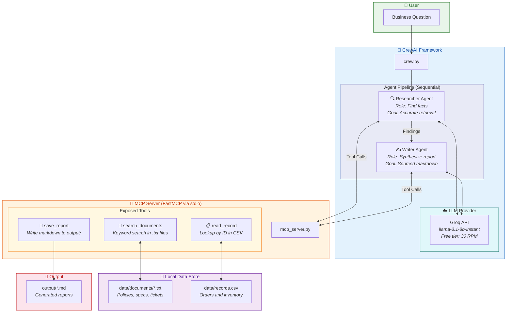
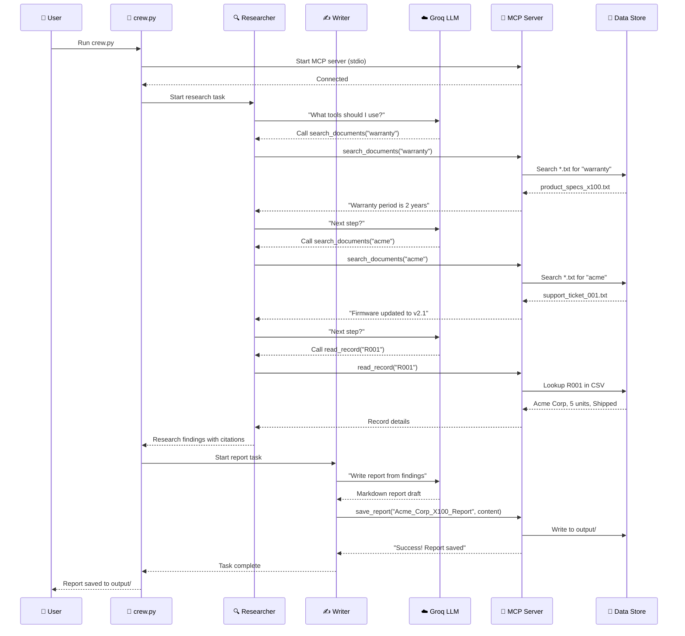

# High-Level Design (HLD) — Operations Assistant

## Architecture Overview

This project implements a **multi-agent AI system** that connects to a local MCP (Model Context Protocol) server to answer business questions using local documents and structured data.

## Data Flow

## Component Details

| Component | File | Responsibility |
|-----------|------|----------------|
| **MCP Server** | `mcp_server.py` | Exposes 3 tools over stdio transport using FastMCP |
| **Crew Orchestrator** | `crew.py` | Configures agents, tasks, and LLM; runs the sequential crew |
| **Sample Data** | `data/` | 10 text documents + 15-row CSV of inventory records |
| **Unit Tests** | `tests/test_mcp.py` | Tests all 3 MCP tools directly (search, read, save) |
| **E2E Test** | `tests/test_crew.py` | Smoke test for crew importability |
| **Output** | `output/` | Where generated markdown reports are saved |

## Security Measures

| Risk | Mitigation |
|------|------------|
| Path traversal via `save_report` title | Title sanitized to alphanumeric only |
| Empty/malicious tool inputs | All tools validate inputs, return clear error messages |
| Runaway agent loops | `max_iter=10` on all agents |
| API key exposure | `.env` in `.gitignore`; `.env.example` has placeholders only |
| Prompt injection in documents | Task prompts enforce citation-only answers; no fabrication |

## Tech Stack

| Layer | Technology |
|-------|------------|
| Language | Python 3.12 |
| MCP Server | FastMCP (mcp SDK) |
| Agent Framework | CrewAI |
| LLM Provider | Groq (llama-3.1-8b-instant) |
| LLM Routing | LiteLLM |
| Testing | pytest |
| Config | python-dotenv |
